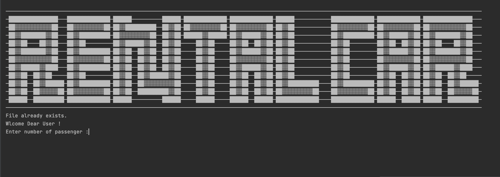

# Software security Project

We used the following principles in our project :

Minimize trust surface:
The user must enter information into our program, and the program uses that information to select the ideal car for the user. We should therefore double-check each input to avoid a program crash.

Isolation:
For each type of car, we utilized multiple classes in our program. The application must prevent objects unrelated to the class from accessing their methods.

## Objective

To choose car with minimal price suitable to the user

## Start up Picture  

